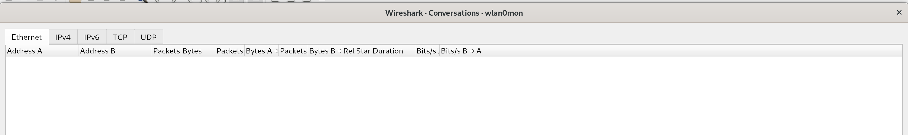

# Sécurité de réseaux sans fil

# Laboratoire d'introduction 802.11

__Ce laboratoire n'a pas de rendu. Il ne sera pas noté. Vous pouvez travailler en équipes de 2 personnes.__

__Le temps prévu pour ce travail de laboratoire est de 4 périodes__

__Il est fortement conseillé d'employer une distribution Kali__ (on ne pourra pas assurer le support avec d'autres distributions). __Si vous utilisez une VM, il vous faudra une interface WiFi USB, disponible sur demande__.

# Objectif

* Capture de données sans-fil
* Capture sur un canal fixe
* Exploration de la couche physique dans 802.11
* Exploration de la couche MAC dans 802.11
* Exploration des fonctionnalités de management dans 802.11


# La magie de la capture de trafic WiFi

À différence d'autres laboratoires que vous avez fait dans le passé, il peut être difficile de faire vos propres captures quand il s'agit de WiFi, à cause de différentes raisons. Le problème principal c'est la carence de drivers Windows capables de capturer des trames au niveau 802.11. Le mode "promiscuous", utile pour Ethernet, ne fonctionne pas pour WiFi.

Dans certains systèmes, tels que macOS et Linux, il est possible de demander au système d'exploitation d'accepter les trames 802.11 directement. Ceci nécessite une configuration particulière de votre interface WiFi appelée, "Monitor mode" (pensez à ceci comme le mode promiscuous pour WiFi). Si votre système supporte ce mode (dépendant du chipset de l'interface WiFi et des drivers), vous pourrez capturer directement les trames "802.11 plus radiotap header" dans Wireshark (options de capture).

Une deuxième difficulté c'est le fait qu'une interface qui capture en mode monitor, n'est souvent pas disponible pour une utilisation régulière. Ceci veut dire qu'il vous faut deux interfaces (ou deux machines), une pour générer du trafic et l'autre pour capturer l'activité sans-fil. Pendant que vous capturez, vous n'avez normalement pas accès à l'Internet ou au réseau local à travers la même Interface WiFi.

Une troisième difficulté vient du fait qu'une interface 802.11 pas associée à un réseau, saute de canal en canal de manière aléatoire. Vous devez donc vous assurer de **fixer l'interface sur le bon canal**, ce qui peut varier en fonction de l'interface, le driver, etc. En vous présentera une méthode très fiable pour choisir un canal pour la capture.

Enfin, notez qu'une capture en mode moniteur permet d'enregistrer toute activité sans-fil à proximité. Puisque les appareils sans-fil 802.11 sont omniprésents et que les protocoles sont complexes, il est certain que votre trace capturera le trafic indésirable d'autres ordinateurs situés à proximité, ce qui générera des volumes très importants de données en très peu de temps. Ce comportement peut rendre difficile l'observation de votre propre trafic et impose la bonne utilisation de filtres da capture et affichage; beaucoup plus que pour les réseaux Ethernet.


#### Mode monitor

Si vous utilisez votre propre ordinateur avec un Linux natif, nous allons favoriser l'utilisation de votre propre interface WiFi. Si c'est le cas, mais que votre Linux n'est pas une version de Kali, vous devez installer la suite ```aircrack-ng```, qui est normalement disponible sur les gestionnaires d'installation de toutes les distributions principales. Si vous utilisez Kali Linux, tout est déjà préinstallé pour vous.

Les paragraphes suivants vous indiquent la manière de passer une interface en mode monitor. Si vous n'arrivez pas à faire fonctionner votre propre interface ou que vous n'utilisez pas Linux en natif (l'interface WiFi interne de votre machine n'est pas disponible pour les VMs), vous pouvez nous demander une interface USB.

Assurez-vous que les ports USB de votre VM ne sont pas configurés pour une version d'USB inférieur à la 2, surtout si vous utilisez VirtualBox. Attention aussi à l'utilisation de la version 3 de USB. Certaines interfaces ne fonctionnent pas correctement sur un port USB virtualisé configuré de cette manière.

Pour passer une interface, par exemple, Alfa AWUS036H, AWUS036NH, AWUS051NH ou __très probablement l'interface de votre propre laptop__ en mode monitor, il faudra utiliser la commande suivante (**vérifiez** avec ```ifconfig``` ou ```iwconfig``` que votre interface s'appelle bien ```wlan0```. Sinon, utilisez le nom correct dans la commande):

```bash
sudo airmon-ng start wlan0
```

Vous retrouverez ensuite une nouvelle interface ```wlan0mon``` (le nom peut être différent sur votre système) qui fonctionne en mode monitor.


*Inteface Alfa AWUS036H*


*Inteface Alfa AWUS036NH*


*Inteface Alfa AWUS051NH*

Si vous avez un message d'erreur (peut arriver avec les versions plus récentes de Kali), il vous faut le firmware de l'interface Alfa. Pour cela, tapez les commandes suivantes :

```bash
sudo apt update
sudo apt install firmware-misc-nonfree
```

Si vous utilisez les interfaces Alfa __AWUS036ACH__ (interfaces noires), et que la méthode précédente ne fonctionne pas, il faudra faire les manipulations suivantes pour les configurer en mode monitor. __ATTENTION, utilisez les commandes suivantes uniquement si vous utilisez les interfaces AWUS036ACH__ :

### Installer le driver (disponible sur Kali. Pour d'autres distributions, il faudra probablement le compiler à partir des sources) :

```bash
sudo apt-get install realtek-rtl88xxau-dkms
```

Ensuite, pour passer en mode monitor :

#### Mettre l'interface “down”

```bash
sudo ip link set wlan0 down
```

#### Configurer le mode monitor

```bash
sudo iwconfig wlan0 mode monitor
```

#### Si vous devez compiler le driver :

```bash
git clone https://github.com/astsam/rtl8812au.git
cd rtl8812au
make
sudo make install
```


*Inteface Alfa AWUS036ACH*


# Inspection d'une capture

### Fixer le canal de la capture

Une manière peu élégante, mais très efficace de vous assurer que l'interface reste fixe sur un canal donné c'est en utilisant la commande ```airodump-ng``` de la suite ```aircrack-ng```. Sur un terminal séparé, vous pouvez lancer la commande suivante :

```
airodump-ng wlan0mon
```
Vous devez évidemment utiliser le nom correct de votre interface si ce n'est ```wlan0mon```. Vous remarquerez en haut de l'interface de ```airodump-ng``` que votre canal change de manière aléatoire. Arrêtez ```airodump-ng``` (Ctrl-C) et relancez-le avec la commande suivante :

```
airodump-ng --channel 6 wlan0mon
```

Cette fois-ci vous pouvez constater que l'interface capture uniquement sur le canal 6. En Suisse, vous trouverez des transmissions sur les canaux 1 jusqu'au 13.

Si vous voulez réaliser des captures avec Wireshark ou un autre outil sur un canal précis, vous pouvez donc laisser cette fenêtre ouverte pendant que vous faites votre capture.

Pour les manipulations suivantes, vous pouvez laisser l'interface sauter de canal en canal.

### Capturer un peu de trafic

Après avoir configuré votre interface en mode monitor, lancez une capture avec Wireshark et arrêtez-la après quelques secondes. Vous trouverez quelque chose qui ressemble à ceci :


Si vous n'arrivez pas à capturer vous-même, vous pouvez [télécharger un fichier de capture](files/Capture.pcap). Il est pourtant fortement conseillé de faire fonctionner le Monitor mode maintenant. Ce sera indispensable pour les laboratoires suivants.

On va jeter an oeil au format de la trame 802.11. Il y a plusieurs types de trames 802.11 qui seront capturés. Le champ "Info" décrit le type, tel que Beacon, Data, etc.

### Inspecter une trame de Data

La trame de type Data transporte des paquets de données dans le réseau 802.11 Identifiez une trame de typa Data et cliquez dessus pour explorer les détails.


### Inspecter les couches des protocoles capturés

* "Frame" c'est une couche rajoutée par Wireshark avec des informations sur le temps et longueur de la trame. Il ne s'agit pas de bits vraiment capturés.


* Radiotap est aussi une couche créée par Wireshark pour afficher les paramètres de la couche physique, telles la puissance du signal et la modulation. Ignorez cette couche pour l'instant. On en reviendra plus tard.


* IEEE 802.11 c'est les bits de la trame Data. Ceci est la couche qui nous intéresse maintenant. La couche est sélectionnée et ouverte dans la figure suivante afin de montrer les valeurs internes.


* Data c'est une couche qui contient la payload de la trame. Elle contient les protocoles de couches supérieures (LLC, IP, etc.).


*Notez que si Wireshark peut comprendre le contenu de la payload de la trame de Data, il crée des couches pour ceux-ci. Pourtant, dans notre exemple (et dans beaucoup de cas), les payloads sont chiffrées et apparaissent donc comme un seul registre. Il est possible de donner à Wireshark les clés nécessaires pour déchiffrer et afficher chaque couche de la payload.*

### Ouvrir la couche IEEE 802.11 de la trame de Data inspecter les détails de différents éléments

* __Frame Control__ : contient le Type et Subtype de la trame (par exemple, Data), ainsi que d'autres flags. On regardera plus en détail tout à l'heure.
* __Duration__ : ce champs informe aux Stations combien de temps est nécessaire pour finir la transmission
* __BSS identifier, transmitter address, source address et destination address__ : ces champs identifient qui transmet le paquet, qui doit le recevoir et qui aurait peut servir d'intermédiaire. Le BSS Id c'est l'adresse de l'AP.
* __Fragment et sequence number__ : ces champs numérotent les trames en cas de besoin de défragmentation ou retransmission, si nécessaire. Le sequence number augmente avec chaque nouvelle transmission.
* __Frame check sequence__ : ceci est un CRC calculé sur la trame. Il se trouve physiquement à la fin, mais il est montré avec d'autres paramètres de l'entête 802.11.
* Il peut y avoir également un champ WPA2 (ou WPA ou WEP) avec des paramètres de sécurité, si la payload est chiffrée.

### Ouvrir le champ Frame Control et le regarder en détail


Toutes les trames 802.11 commencent avec un champ Frame Control et les détails des sous-champs et flags déterminent le format du rest tu message. Ces sous-champs sont :

* Version, avec une valeur de zero pour la version actuelle
* Type et Subtype spécifient le type de trame, par exemple, Data, ACK, etc.

### Ouvrir le champ Flags et le regarder en détail

* __To DS__ : ce flag est à 1 si la trame est envoyée d'une STA vers le réseau câblé à travers un AP.
* __From DS__ : ce flag est à 1 si la trame est envoyée du réseau câblé vers une STA.
* __More Fragments__ : il est à 1 si il y a plus de fragments qui suivent le message présent.
* __Retry__ : ce flag est à 1 si cette trame est une retransmission.
* __Power Management__ : il est à 1 si l'émetteur du message rentrera en mode veille après la transmission.
* __More Data__ : à 1 si l'émetteur a plus de trames à envoyer
* __Protected__ : il est à 1 si la trame est chiffrée avec WEP/WPA/WPA2.
* __Order__ : il est à 1 si le récepteur doit garder les trames dans l'ordre.


# La Couche Physique

On regardera plus en détail les différentes parties du système sans-fil, commençant par la couche physique. À ce niveau le plus bas, envoyer et recevoir des messages se traduit en bande de fréquence, modulation, rapport signal/bruit. On peut regarder toutes ces valeurs utilisant les informations de la couche Radiotap. La fréquence ou le canal sont les mêmes pour toutes les trames d'un même réseau, puisque l'interface est configurée pour écouter sur une fréquence fixe.

### Trouver la fréquence en ouvrant la couche Radiotap de n'importe quelle trame et regardant le Channel frequency.

Comme vous le voyez dans l'image ci-dessous, la fréquence du canal est 2437 MHz, ou 2.437 GHz. Elle est connue comme "802.11b/g channel 6".


### Ajouter deux nouvelles colonnes pour le débit de transmission (TX Rate) et la puissance du signal reçu RSSI (Received Signal Strength Indicator). Pour cela, il faut aller dans les préférences de Wireshark, dans le menu Columns.


Cliquez sur le + pour ajouter une nouvelle colonne. Changez le titre à RSSI et, dans le menu déroulant dans le champ Type, sélectionnez IEEE 802.11 RSSI. En suite, cliquez à nouveau sur + et ajoutez une nouvelle colonne avec le titre Rate et le type IEEE 802.11 TC rate.


Les colonnes dans la figure seront disponibles quand vous retournerez à l'interface principale. Vous aurez des informations sur le débit et la puissance pour chaque trame.


Vous devriez retrouver une variété de débits. Ceci est nettement différent de Ethernet, où toutes les trames sont envoyées à un débit fixe (après negotiation initiale). Les débits varient en fonction des conditions et des capacités des STAs.

Vous devriez aussi voire une variété de valeurs de RSSI, tel que "-61 dBm". RSSI est mesuré en échèle log où 0 dBm veut dire 1 milliWatt de puissance et chaque +10 veut dire un facteur de 10 plus grand et -10 veut dire un facteur de 10 plus bas. Donc, par exemple, -60 dBm veut dire un millionième de 1 mW, ou 1<sup>-9</sup> Watts, une quantité assez petite de puissance.


# La Couche MAC 802.11

Dans le menu __Statistic__ sélectionner __Conversations__. Vous retrouverez une fenêtre vide comme celle-ci :



En bas, à droite, sélectionnez le bouton __Conversation Types__ et cochez 802.11.


Ceci remplit la fenêtre avec une liste de chaque paire de machines qui communiquent entre elles. On peut ordonner la liste par taille en cliquant sur les entêtes des colonnes Packets ou Bytes.


Une valeur de BSS ID identifie un AP (adresse MAC de l'AP). Pour trouver AP responsable des conversations les plus actives, on peut ordonner par source ou destination.

On peut aussi déterminer combien de différents types de trames se trouvent dans la capture. Les trames 802.11 sont de type Data, Control ou Management. Ces trames peuvent être différenciées par le champ Type dans le Frame Control Field.

Pour filtrer et voir uniquement les trames de Data, on peut utiliser l'expression ```"wlan.fc.type==2"``` dans le filtre d'affichage de la fenêtre principale.


En cliquant sur le sous-champ Type du Frame Control Field nous indique en bas, dans la barre de status, à gauche, que Wireshark connait ce champ avec le nom ```wlan.fc.type```. On peut donc utiliser le filtre ```wlan.fc.type=="data frame"``` ou ```wlan.fc.type==2```.

Après l'application de ce filtre, la barre de status en bas à droite nous indique combien de paquets sont affichés. Ceci indique combien de trames de Data sont présentes dans la capture.

Vous pouvez faire le même exercice pour les trames de Control (Type 1) et les trames de Management (Type 0), en changeant le filtre d'affichage. Ceci vous permettra de trouver combien de trames il y en a de chaque type et quel est le type le plus nombreux.


On remarque qu'il y a 184 trames de Data ou 15.4% du total de 1194 trames.

Regardez le pourcentage de trames de Control et de Management dans votre capture. Pour les trames de control, il n'est pas rare de trouver un pourcentage similaire au nombre de trames de Data. La trame de Control la plus commune c'est le ACK.

Quand vous regardez ces trames, faites attention à la longueur. Les trames de données peuvent être très longues, jusqu'à 1500 octets. Les trames de Management sont typiquement beaucoup plus petites et les trames de Control très, très petite.

La trame de Management la plus commune c'est le Beacon. Les trames de Management se présentent régulièrement dans le "background" à cause des Beacons.

Si vous inspectez maintenant une trame de ACK, vous remarquerez qu'elle a moins de champs par rapport à la trame Data. Par exemple, elle n'a qu'une seule adresse !

On sait que les transmissions sans-fil ne sont pas très fiables. On peut estimer le taux de retransmission en regardant combien de trames ont le bit Retray à 1. Ce bit indique que la trame est une retransmission de l'originale.

On peut faire ceci utilisant un filtre d'affichage qui montre les trames de Data originales (```wlan.fc.type==2 && wlan.fc.retry==0```) et en suite les trames de Data qui ont été retransmises (```wlan.fc.type==2 && wlan.fc.retry==1```).

On peut aussi regarder combien de STA étaient sur le point d'entrer en veille. Ceci identifie plus typiquement les téléphones mobiles qui utilisent cette fonctionnalité pour économiser la batterie. On peut faire ceci avec le filtre : ```wlan.fc.pwrmgt==1```


# Management

On va jeter un oeil à quelques types de trames de Management qui sont utilisées pour connecter la STA à un AP.

### Trames Beacon

Sélectionnez une trame de Beacon dans votre capture. Les trames de Beacon sont envoyées périodiquement par un AP pour faire connaître son existence et ses capacités aux ordinateurs voisins. La couche IEEE 802.11 pour cette trame sera similaire à la couche pour une trame de données que nous avons examiné avant, avec des codes de type et de sous-type différents pour indiquer qu'il s'agit d'une trame Beacon.
Toutefois, la payload de cette trame sera différente : il s'agit d'une couche "IEEE 802.11 wireless LAN". Vous verrez qu'après quelques paramètres fixes, elle possède une série de paramètres qui énumèrent les capacités de l'AP. Ces paramètres comprennent le nom du réseau (SSID) du point d'accès (une chaîne de texte qui accompagne le BSS ID), les débits de données qu'il prend en charge et le canal sur lequel il fonctionne.

Ouvrez la payload de la trame Beacon pour voir ses "Tagged parameters".

1. Le SSID de l'AP
2. Pour voir à quelle fréquence les trames de Beacon sont envoyées pour l'AP, vous trouverez le "Beacon interval" donné dans la trame de Balise. Vous constaterez ici que les trames Beacon sont souvent envoyées par l'AP toutes les 102.4 millisecondes, soit une cadence d'environ 1/10 de seconde. Les Beacons apparaissent régulièrement dans la capture, et lorsqu'il n'y a pas de transfert de données, ils constituent souvent le trafic principal.
3. Les débits de données pris en charge par l'AP sont répertoriés sous les "Tagged parameters".
4. Vous pouvez trouver le taux de transmission de la trame Beacon dans l'en-tête Radiotap, ou de manière plus pratique dans la colonne que vous avez ajoutée dans une étape précédente. Les trames Beacon sont souvent transmises à un taux de 1 Mbps. Ceci est typique. Un faible débit est utilisé pour permettre aux balises d'être reçues sur une plus grande zone autour du point d'accès (puisqu'un débit plus faible peut généralement être reçu avec un signal plus faible).


### Association

Une fois qu'un ordinateur a appris l'existence d'un AP via un AP ou autre, il doit s'associer à l'AP et s'authentifier de manière visible avant de pouvoir utiliser le réseau sans fil. Vous verrez l'ordinateur envoyer la demande d'association à l'AP jusqu'à ce qu'il en ait accusé réception. Si l'association est réussie, l'AP renvoie une réponse d'association, dont l'ordinateur accusera réception. La demande et la réponse d'association contiennent des informations qui décrivent les capacités de l'AP et de la STA, telles que les débits qu'il prend en charge. De cette façon, les deux interlocuteurs peuvent connaître les capacités de l'autre.

Notez que la demande d'association est de Type 0 (Management) et de Subtype 0. La réponse d'association est de Type 0 (Management) et de Subtype 1.


### Probe Request/Response

Enfin, nous examinerons brièvement les trames Probe. Au lieu d'attendre qu'une STA se renseigne sur un AP à travers de balises, la STA peut rechercher des AP spécifiques. Un Probe Request est envoyé par une STA pour tester si un AP avec un SSID spécifique est à proximité. Si le point d'accès recherché est proche, il répondra par une nouvelle trame Probe. Comme les trames de Beacon et d'association, chacune de ces trames a l'en-tête habituel et comporte une liste de paramètres décrivant les capacités de l'ordinateur et du point d'accès. Il est courant que les STA envoient des Probe Requests pour des réseaux sans fil qu'ils ont précédemment utilisés pour accélérer la connexion à un réseau connu, par exemple lorsqu'un ordinateur portable est rentré chez lui pour la journée. Ainsi, vous pouvez voir une séquence de Probes pour de nombreux SSID différents. Seuls les SSID présents répondront.
Notez que Probe Request est de type 0 (Management) et de Subtype 4. Probe Response est de type 0 (Management) et Subtype 5.
